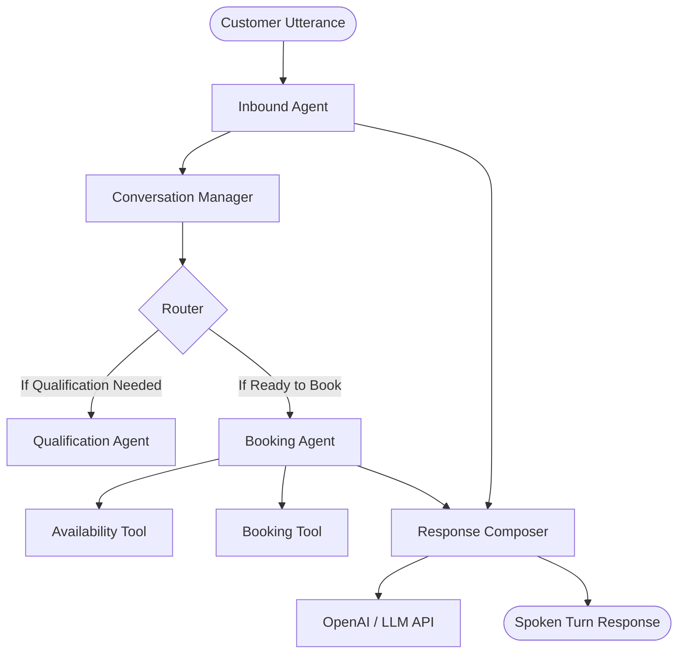

# Breakout Escape Rooms AI Agents

This document describes the architecture, roles, and interactions of the AI agents powering the Breakout Escape Rooms MVP.

---

## Agent Architecture Overview

Our system uses a multi-agent cooperative architecture where agents coordinate statefully through a centralized conversation memory layer.

---

## 1. Inbound Agent (`src/agents/inbound_agent.py`)
* **Role**: Front Desk / Inbound Dispatcher
* **Responsibilities**:
  * Acts as the primary entry point for all customer turns.
  * Conducts intent detection, handles conversational interruptions (FAQs, rules explanations, and rescue comments).
  * Directs the dialogue flow and qualifications using the `Router`.
  * Manages fallback/failsafe paths when LLM dependencies are down or unresponsive.

---

## 2. Qualification Agent (`src/agents/qualification_agent.py`)
* **Role**: Intake / Lead Qualification Specialist
* **Responsibilities**:
  * Stateful extraction and validation of mandatory booking fields based on intent.
  * Ensures that participants, location, preferred date, and age group are captured.
  * Captures corporate-specific details (food requests, budget tiers) for corporate booking intents.
  * Raises confirmations for low-confidence state corrections or changes mid-dialogue.

---

## 3. Booking Agent (`src/agents/booking_agent.py`)
* **Role**: Scheduling & Confirmations Coordinator
* **Responsibilities**:
  * Takes over the conversation once qualification is complete.
  * Querying live/mock calendar slots via the `AvailabilityTool`.
  * Managing the multi-step slot selection and booking confirmation process.
  * Delegating creation/cancellation/rescheduling operations via the `BookingTool` and the `BookingOrchestrator`.
  * Preserving terminal conversation states (handling final greetings and goodbye sequences).

---

## 4. Response Composer (`src/response_composer.py`)
* **Role**: Copywriter / Humanization Engine
* **Responsibilities**:
  * Post-processes raw agent drafts into humanized, brief, spoken-friendly dialogue turns.
  * Enforces the Breakout voice rules (no robotic clichés, maximum word count bounds, single next question).
  * Safe fallback to deterministic templates under network, rate limit, or auth errors.
