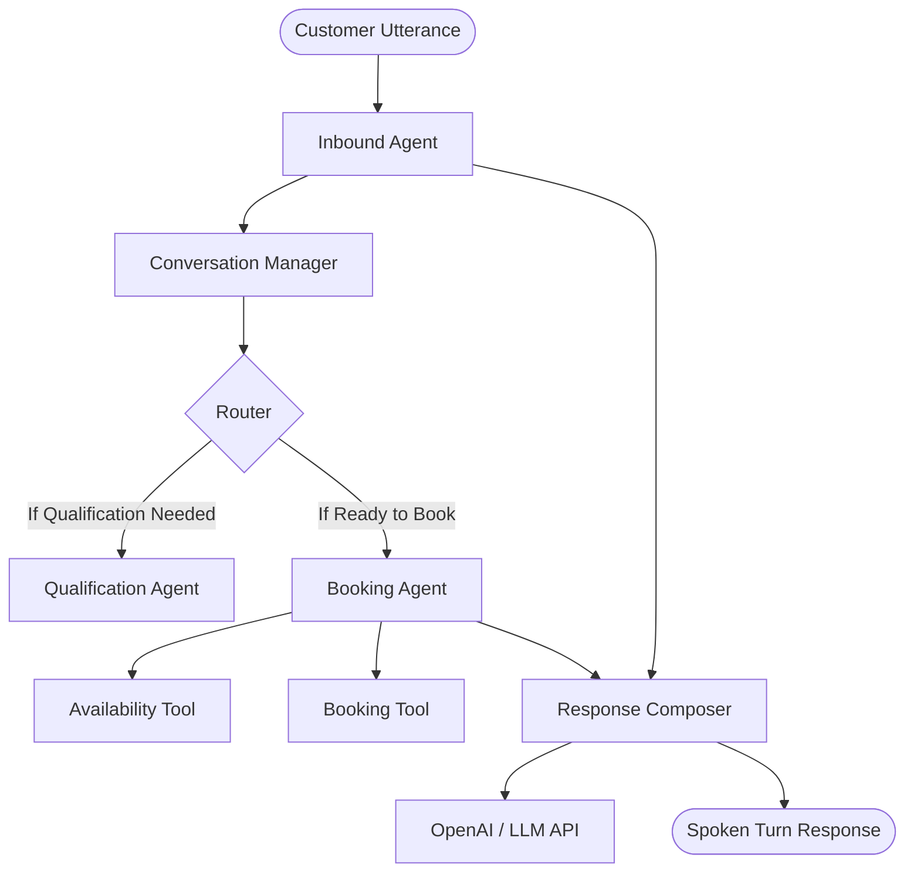

# Breakout Escape Rooms - AI Voice Agent Platform MVP

An advanced, production-hardened multi-agent cooperative AI voice platform powering the inbound customer center for Breakout Escape Rooms. This platform handles intents ranging from booking qualification, live game recommendation, payment processing/status polling via the Kreeda gateway, and graceful human handoff with multi-turn customer notes collection.

---

## Agent Architecture Overview

Our system uses a multi-agent cooperative architecture where agents coordinate statefully through a centralized conversation memory layer.



1. **Inbound Agent** (`src/agents/inbound_agent.py`): Primary front desk dispatcher, handles intent detection, conversational interruptions, rules explanations, and rescue comments.
2. **Qualification Agent** (`src/agents/qualification_agent.py`): Extracts and validates booking fields (location, date, time, group size, age group) before slot booking.
3. **Booking Agent** (`src/agents/booking_agent.py`): Queries live slots using `AvailabilityTool` and coordinates the final checkout link creation.
4. **Escalation Agent** (`src/agents/escalation_agent.py`): Tracks conversation safety, loop-detection, and structures human-handoff details.
5. **Response Composer** (`src/response_composer.py`): Enforces the Breakout voice (brief, conversational, under-20-word guidelines).

---

## Key Production Hardening Features

### 1. Payment Processing & Polling
* **Hosted Checkout**: Creates a payment link appending `?pr=true` to force hosted checkout with the Pay button.
* **Status Polling**: The backend and voice flows poll `check_payment_status` using the `bookingId` from Kreeda every 15–30s to verify live transaction success while the user remains on the line.

### 2. Human Escalation & Notes Gathering
* **Stateful Notes Gathering**: If a human transfer is triggered (e.g., safety, complaint, or repeated loops), the agent does not immediately sever the call. It asks: *"Is there anything else you'd like our team to know before they contact you?"*, saves the notes, creates a handoff ticket, and then gracefully bids farewell.
* **ASR Word Normalization**: Text transcriptions of phone numbers (e.g. `"eight two one seven zero zero eight four two zero seven"`) are normalized to standard digit formats (`82170084207`) including support for `"zero"` and `"oh"` values to prevent phone parsing failures.
* **Loop Protection**: Tracks consecutive phone requests when unresolved queries occur; if the customer ignores requests 3 times, a `"Repeated conversation loop detected"` escalation is triggered.

---

## Setup & Installation

### Environment Configuration
Create a `.env` file in the root directory:

```dotenv
OPENAI_API_KEY=your_openai_api_key
OPENAI_MODEL=gpt-4.1-mini
VAPI_API_KEY=your_vapi_api_key
VAPI_ASSISTANT_ID=your_vapi_assistant_id
VAPI_TOOL_ID=your_vapi_tool_id
BOOKING_API_KEY=your_kreeda_api_key
BOOKING_BASE_URL=https://bs.kreeda.icu
WHATSAPP_ENABLED=true
WHATSAPP_PROVIDER=wati
WHATSAPP_ACCESS_TOKEN=your_wati_token
WHATSAPP_API_ENDPOINT=https://live-mt-server.wati.io/1070847
```

### Quick Start
1. Initialize the environment and install dependencies:
   ```bash
   pip install -r requirements.txt
   ```
2. Run the unit test suite (validates 1,459 production rules and regression tests):
   ```bash
   PYTHONPATH=. pytest tests/
   ```
3. Launch local services and tunnel using ngrok:
   ```bash
   ./deploy.sh
   ```

---

## Deployment Script (deploy.sh)

The `./deploy.sh` script automates the complete developer environment setup:
1. **Frontend Assets**: Re-builds all Vite React frontend components into production bundles.
2. **Process Hardening**: Port `8010` is checked, and any previous running servers or dead ngrok processes are cleanly terminated.
3. **Uvicorn Server**: Spawns the FastAPI backend server on port `8010` (`/tmp/uvicorn.log`).
4. **Ngrok Tunneling**: Sets up a public HTTPS tunnel mapping to port `8010` (`/tmp/ngrok.log`).
5. **Vapi Webhook Auto-Patching**: Reads the active Ngrok public URL and programmatically updates the configured Vapi Assistant (`VAPI_ASSISTANT_ID`) and Vapi Tool (`VAPI_TOOL_ID`) using Vapi's REST APIs. If Vapi credentials are not provided or are expired, it outputs a non-blocking warning and outputs the public URL for manual updates.

---

## Live Integration (Vapi)

Ensure your Vapi Dashboard is pointing to your active ngrok tunnel (if the automated patch script skipped it):
* **Assistant Webhook**: `https://<your-ngrok-subdomain>.ngrok-free.dev/vapi/webhook`
* **Tool Webhook**: `https://<your-ngrok-subdomain>.ngrok-free.dev/vapi/tool`
