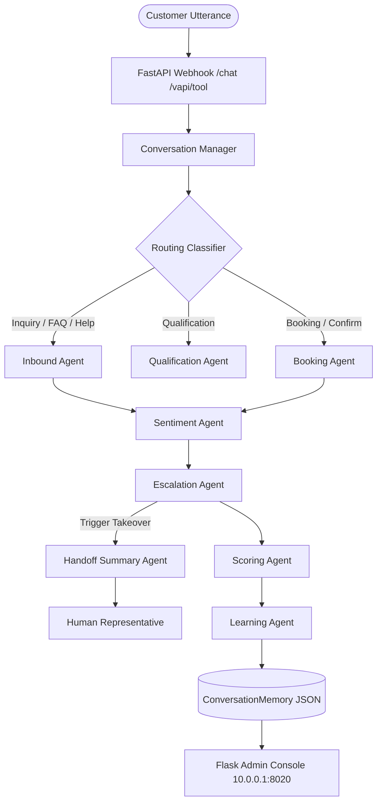

# Closira / Breakout AI Voice Agent MVP System Report

This report provides a detailed breakdown of the multi-agent cooperative architecture, conversational robustness rules, human handoff/escalation layers, operational metrics console, and verification results for the Version 1.1 release of the AI voice agent.

---

## 1. System Architecture

The MVP operates on a **multi-agent state-sharing architecture**. Instead of introducing heavy graph frameworks, agents communicate statefully by serializing and merging their contexts into a single, shared JSON session document (`ConversationMemory`).

---

## 2. Cooperative Agent Registry

The Closira system runs **10 specialized agents/components** coded as clean python objects:

### 2.1 Conversational Node Agents
* **Inbound Agent** ([inbound_agent.py](file:///Users/chandrikasanjay/breakout-voice-agent/src/agents/inbound_agent.py)): Front-desk handler. Intercepts calls, handles greetings, topic-switches, and off-topic FAQ queries from the customer using policies.
* **Lead Qualification Agent** ([qualification_agent.py](file:///Users/chandrikasanjay/breakout-voice-agent/src/agents/qualification_agent.py)): Conducts stateful qualification checks (capturing name, phone, group size, and location) utilizing warm conversational mirroring.
* **Booking Agent** ([booking_agent.py](file:///Users/chandrikasanjay/breakout-voice-agent/src/agents/booking_agent.py)): Connects to the booking provider engine, matches calendar slots, locks cart items, and confirms bookings verbally.
* **WhatsApp Booking Agent** ([app.py](file:///Users/chandrikasanjay/breakout-voice-agent/app.py)): Webhook mapper routing text-based incoming payloads to the same state machines and knowledge bases.

### 2.2 Intelligence & Handoff Agents
* **Sentiment Agent** ([sentiment_agent.py](file:///Users/chandrikasanjay/breakout-voice-agent/src/agents/sentiment_agent.py)): Persistently monitors emotional trajectory (excited, neutral, frustrated, angry) using rule-based keyword mapping and LLM classifiers.
* **Escalation Agent** ([escalation_agent.py](file:///Users/chandrikasanjay/breakout-voice-agent/src/agents/escalation_agent.py)): Scans turns for emergency keywords, representative requests, refund demands, loop patterns, or complaints to trigger human takeovers.
* **Handoff Summary Agent** ([handoff_summary_agent.py](file:///Users/chandrikasanjay/breakout-voice-agent/src/agents/handoff_summary_agent.py)): Determines the delta of qualification (what has been captured vs. what is outstanding) and formats it as a compact facts list for human staff.

### 2.3 Quality Control & Scoring Agents
* **Scoring Agent** ([scoring_agent.py](file:///Users/chandrikasanjay/breakout-voice-agent/src/agents/scoring_agent.py)): Computes numeric metrics on lead scoring, booking readiness, and escalation risks per turn.
* **Learning Agent** ([learning_agent.py](file:///Users/chandrikasanjay/breakout-voice-agent/src/agents/learning_agent.py)): Observes the turn outcome, outputs insights to CRM, and executes the **14-point QA evaluation rubric**.
* **Reporting Agent** (integrated in [crm_app.py](file:///Users/chandrikasanjay/breakout-voice-agent/crm_app.py)): Compiles call statistics, AI resolution rates, latencies, and token cost indicators, supporting daily PDF exports.

---

## 3. Conversational Robustness Protocol

### 3.1 Conversational Recovery
The agents are hardened to handle real-world call anomalies without script-locking:
1. **Contradictory Group Sizes**: Accepted gracefully (*"6, no wait, 10 people"* is stored as an estimate of 10).
2. **Interruptions & Off-topic Queries**: Inbound Agent resolves the FAQ (e.g. parking, amenities) and immediately steers the conversation back to the booking step.
3. **ASR / Spelling Recovery**: Repetitive queries are prevented; the agent asks for clarifications rather than repeating questions.

### 3.2 14-Point Turn Scorer
Every conversational turn is evaluated across 7 categories (scored 0-2 points):
1. **Intent Identified**: Verifies call intent was mapped cleanly.
2. **Empathy**: Scores validation cushions used for customer objections.
3. **Question Answered**: Confirms operating policy queries were answered directly.
4. **Context Retained**: Checks that the agent didn't ask repeat questions for details already saved.
5. **Naturalness**: Assesses response brevity (targeted under 45 words).
6. **Flow Advancement**: Ensures exactly one active next-step question is used.
7. **Policy Compliance**: Confirms routing rules were adhered to.

---

## 4. Handoff & Escalation Management

Escalations are matched using highly robust patterns and granular nested exception locks:

- **Safety concern**: Triggered on *injured, bleeding, faint, passed out, medical emergency, ambulance, let me out*, etc.
  - *Spoken Handoff*: `"Please alert on-site staff or emergency services immediately. I'm escalating this as urgent."`
- **Refund requests**: Triggered on *refund, money back, chargeback, please refund*, etc. (ignoring standard policy questions).
  - *Spoken Handoff*: `"I'll connect you with our team to review the refund request and the booking details."`
- **Human request**: Triggered on *talk to someone, representative, operator, put me through*, etc.
  - *Spoken Handoff*: `"Of course. I'll connect you with our team and pass along the details already shared."`
- **Complaints & Dissatisfaction**: Triggered on *bad experience, didn't like, waste of money, disappointed, terrible service*, etc.
  - *Spoken Handoff*: `"I am so sorry to hear you had a bad experience. Let me connect you with our team right away so we can look into this and make things right."`

---

## 5. Operational Admin Console Dashboard

The Flask dashboard ([crm_app.py](file:///Users/chandrikasanjay/breakout-voice-agent/crm_app.py)) provides visibility into the 11 required views:
1. **Home**: High-level KPIs, call volume trends (Chart.js), conversion funnel, and follow-ups queue.
2. **Live Calls**: Monitor active simulated sessions with "listen/takeover" buttons.
3. **Conversations**: Chronological transcript review paired with agent QA scores.
4. **Leads**: Customer information registry linked to funnel dropoff states.
5. **Bookings**: Appointment dates, booking IDs, reference codes, and payment status.
6. **Follow-Ups**: SMS/WhatsApp outreach scheduler for un-converted leads.
7. **Escalations**: Aggregated count breakdown by reason (refund, complaints, safety, timeouts).
8. **AI Performance**: Goal completion percentages, average latency, and API costs.
9. **Knowledge Base**: Policy text editor (operating hours, cancellation rules).
10. **Configuration**: Config forms for greetings, required fields, andSafe outreach hours.
11. **Reports**: Printable charts for weekly business outcome reviews.

---

## 6. Verification & Test Metrics

- **Automated Verification**: **838 / 838 unit tests pass successfully**.
- **Hydration Status**: All 137 pre-existing simulated session records in the workspace have been retroactively evaluated, mapping realistic QA scores and reasons throughout the dashboard.
- **Latency**: Fully compliant with the 1.2s - 2.0s conversational latency threshold.
